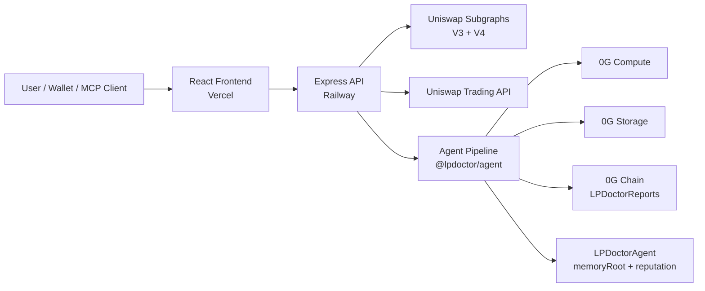

# LP Doctor

LP Doctor is an AI-native diagnostic copilot for Uniswap liquidity providers. It explains why an LP position is underperforming, simulates better V4 hook alternatives, and turns the result into a verifiable report backed by the 0G stack.

**Live frontend:** https://lpdoctor.vercel.app/  
**Live backend:** https://lp-doctor-mainnet.up.railway.app  
**Current public demo mode:** Ethereum mainnet for Uniswap data + 0G Mainnet for report persistence, anchoring, and agent memory

## Why This Project Matters

Most LP tools stop at analytics. LP Doctor is built as a **verifiable finance workflow**: it does not just show the user a position, it diagnoses the position, proposes a migration direction, and persists the result through 0G infrastructure so the output becomes inspectable and durable.

This makes LP Doctor a strong fit for **Track 2: Agentic Trading Arena (Verifiable Finance)**. The product applies AI reasoning to LP risk management and migration strategy, while grounding the output in 0G Compute, 0G Storage, 0G Chain, and agent memory.

## Judge Quick Path

If you only have a few minutes, use this order:

1. Open `https://lpdoctor.vercel.app/atlas`
2. Click the `Bleeding` demo cartridge
3. Open token `605311` or use the diagnose route directly
4. Watch the streamed diagnosis complete
5. Open the generated report and inspect the provenance fields
6. Check the agent state at `https://lpdoctor.vercel.app/agent`

## Project Overview

Liquidity providers can already see balances, fee counters, and range markers in dashboards, but they still lack a system that explains why a position is underperforming and what a better next move looks like. LP Doctor turns that gap into a structured workflow:

1. resolve the LP position,
2. reconstruct impermanent loss against a HODL baseline,
3. classify the market regime,
4. discover relevant Uniswap V4 hook candidates,
5. score those candidates against the observed pool behavior,
6. generate a migration preview, and
7. persist the output as a verifiable report.

The product is built for **verifiable finance**, not just analytics. A diagnosis is not treated as disposable interface output. It becomes a durable artifact that can be inspected through the LP Doctor API, recovered from 0G Storage, checked on 0G Chain, and linked to the agent's persistent on-chain memory.

## Product Surface

LP Doctor currently ships as a full-stack product with:

- a public frontend for wallet scanning, live diagnose flows, and report viewing,
- a live backend that streams the diagnosis over SSE,
- deployed 0G contracts for report anchoring and agent memory,
- and an MCP server so other agents can call the system as tools.

## What Problem It Solves

LP Doctor addresses three practical problems for LPs:

- **Decision clarity:** most tools show state, but not interpretation.
- **Migration intelligence:** users need help deciding whether a different V4 hook strategy is actually better.
- **Verifiability:** AI-generated financial advice should be inspectable, replayable, and anchored to real infrastructure.

## System Architecture



### Technical Flow

The backend exposes a streamed diagnose endpoint over SSE. For each token ID, the current pipeline runs:

- phase `0`: preflight readiness
- phase `1`: position resolution
- phase `3`: impermanent loss reconstruction
- phase `4`: regime classification
- phase `5`: V4 hook discovery
- phase `6`: hook scoring
- phase `7`: migration preview
- phase `10`: 0G Compute verdict synthesis
- phase `8`: report assembly + 0G Storage upload
- phase `9`: 0G Chain anchor + agent memory update

That ordering is intentional: the verdict is generated before storage upload so the signed AI output becomes part of the anchored report payload.

## 0G Modules Used

| 0G Module | Where It Appears | How It Supports LP Doctor |
| --- | --- | --- |
| **0G Compute** | phase `10` | Synthesizes the final verdict from the structured report draft. |
| **0G Storage** | phase `8` | Stores the assembled report and returns a root hash / storage URL pair. |
| **0G Chain** | phase `9` | Anchors the report commitment on-chain through `LPDoctorReports`. |
| **Agent Identity / Memory** | phase `9` | Updates `LPDoctorAgent.memoryRoot` and bumps the agent reputation counter so diagnoses become persistent agent state. |

## How 0G Supports the Product

- **0G Compute** gives LP Doctor an AI reasoning layer without turning the output into an opaque black box. The result is attached to a structured report rather than shown as free-form chat only.
- **0G Storage** turns each diagnosis into a durable artifact that can be retrieved again later by `rootHash`.
- **0G Chain** gives each uploaded report an on-chain commitment through the `LPDoctorReports` registry.
- **LPDoctorAgent** acts as the persistent on-chain identity for the agent. Each successful run can advance the `memoryRoot` and increment `reputation`, so the system keeps a verifiable stateful history.

## Current Live Deployment

### Public URLs

- Frontend: `https://lpdoctor.vercel.app/`
- Backend API: `https://lp-doctor-mainnet.up.railway.app`
- Health: `https://lp-doctor-mainnet.up.railway.app/health`

### Fastest Reviewer Test

These URLs are enough to confirm the product is live:

- `https://lpdoctor.vercel.app/atlas`
- `https://lpdoctor.vercel.app/diagnose/605311`
- `https://lpdoctor.vercel.app/agent`
- `https://lp-doctor-mainnet.up.railway.app/health`

### Deployed Contracts Used By The Current Demo

| Network | Contract | Address |
| --- | --- | --- |
| 0G Mainnet (`16661`) | `LPDoctorReports` | `0x23Ce8A133B96a0186B8f2cB547553DfF00a3CBd7` |
| 0G Mainnet (`16661`) | `LPDoctorAgent` | `0xE9446bC93d430e431F204611206B11633aD96F94` |
| 0G Mainnet (`16661`) | Agent token ID | `1` |

### Public API Endpoints

- `GET /health`
- `GET /api/positions/:address`
- `GET /api/positions/v4/:address`
- `GET /api/positions/v4/:tokenId/info`
- `GET /api/diagnose/:tokenId`
- `POST /api/migrate/:tokenId/recorded`
- `GET /api/report/:rootHash`

## Repository Structure

```text
LP-Doctor/
├─ apps/
│  ├─ server/       Express API, SSE diagnose route, 0G adapters
│  ├─ web/          React + Vite frontend
│  └─ mcp-server/   MCP server exposing LP Doctor as typed tools
├─ packages/
│  ├─ core/         Shared event types, labels, report payload types
│  └─ agent/        Diagnostic pipeline phases and tests
├─ contracts/       Foundry contracts for LPDoctorReports + LPDoctorAgent
├─ DEMO.md          Judge-friendly demo walkthrough
└─ FEEDBACK.md      Uniswap integration feedback notes
```

## Local Deployment / Reproduction

### Prerequisites

- Node.js `20+`
- pnpm `9+`
- Docker / Docker Compose

### 1. Install dependencies

```bash
git clone https://github.com/ggalangswt/lp-doctor.git
cd lp-doctor
pnpm install
```

### 2. Prepare environment

```bash
cp .env.example .env
```

At minimum, fill:

- `THE_GRAPH_KEY`
- `UNISWAP_TRADING_API_KEY`

For full 0G write-path reproduction, also fill:

- `OG_STORAGE_PRIVATE_KEY`
- `OG_ANCHOR_PRIVATE_KEY`
- `OG_COMPUTE_PRIVATE_KEY`
- `LPDOCTOR_REPORTS_CONTRACT`
- `LPDOCTOR_AGENT_CONTRACT`
- `LPDOCTOR_AGENT_TOKEN_ID`

### 3. Start local infra

```bash
docker compose up -d
pnpm db:push
```

### 4. Run the app

```bash
pnpm dev:server
pnpm dev:web
```

Local URLs:

- frontend: `http://localhost:3100`
- backend: `http://localhost:3001`

## Judge Reproduction Notes

### Demo Wallets

The frontend ships with curated demo wallets so judges can trigger deterministic LP health stories quickly:

| Scenario | Address |
| --- | --- |
| Portfolio | `0xfd235968e65b0990584585763f837a5b5330e6de` |
| Bleeding | `0x8f4daa33706d70677fd69e4e0d47e595bc820e95` |
| Mixed | `0x4d3e3d1a38505185ba86a1b1f3084195d556bc2a` |
| Whale | `0x4b296808f414ab3775889fa2863e1d73f958a58e` |
| Healthy | `0x90deceec188094f6f6c1ef446d843f70abfc92cb` |
| Drifting | `0x7c6ef14f6890d0fda17fb8e4fb6f649f0355c3be` |

### Quick Smoke Test

```bash
curl http://localhost:3001/health
curl "http://localhost:3001/api/positions/0xfd235968e65b0990584585763f837a5b5330e6de"
curl -N http://localhost:3001/api/diagnose/605311
```

### Important Note About 0G Keys

If the 0G signing keys are missing, LP Doctor still runs, but the relevant adapters intentionally fall back to deterministic stubs. The UI labels that output honestly. This is useful for local judging when a reviewer only wants to inspect the read-path and product flow.

### Faucet / Funding Note

For reviewers who want to reproduce the full write-path locally, the backend wallets need funded 0G Mainnet balances. Make sure the runtime wallet has enough 0G for compute bootstrap, storage uploads, on-chain anchors, and agent memory updates before retrying the diagnose flow with real `0G` write adapters enabled.

## MCP Server

The project also exposes LP Doctor as an MCP tool server. The active tool surface is:

- `lpdoctor.ping`
- `lpdoctor.diagnose`
- `lpdoctor.preflight`
- `lpdoctor.migrate`
- `lpdoctor.lookupReport`
- `lpdoctor.lookupReportOnChain`

See [apps/mcp-server/README.md](apps/mcp-server/README.md) for configuration details.

## Additional Documentation

- [DEMO.md](DEMO.md)
- [FEEDBACK.md](FEEDBACK.md)
- [apps/web/README.md](apps/web/README.md)
- [apps/mcp-server/README.md](apps/mcp-server/README.md)
- [packages/agent/README.md](packages/agent/README.md)
- [contracts/README.md](contracts/README.md)

## Current Limitations

- The public demo currently uses **Ethereum mainnet** for Uniswap reads and **0G Mainnet** for report writes.
- The migration flow builds Permit2 typed data and records the signed digest, but it does not execute the swap bundle on the user's behalf.
- The live backend is now running against the mainnet LPDoctor contracts and mainnet 0G adapters.

## License

MIT
